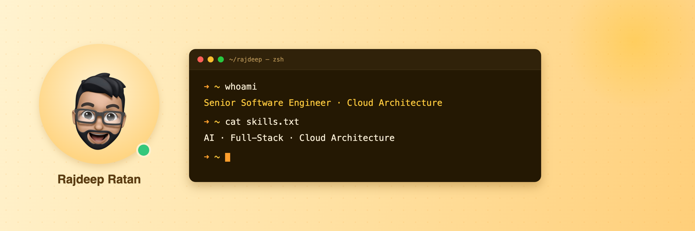

  

  
  
  

  

I build AI-powered systems, full-stack products, and developer tools. I work across the entire stack — from RAG pipelines and LLM integration to the UI the user interacts with — and I care deeply about shipping things that are well-architected and production-ready.

Currently building AI-driven tooling for **mission-critical 911 dispatch infrastructure** at [Intrado](https://www.intrado.com/).

  

### 🔭 What I'm focused on

- Building **RAG systems**, **AI agents**, and end-to-end AI-powered products
- Full-stack architecture with **React**, **Next.js**, **Node.js**, and **TypeScript**
- Cloud infrastructure on **AWS** and **Azure**
- Developer productivity — Claude Code workflows, automation systems, and open-source tooling

  

### 🛠️ Tech Stack

**Languages & Frameworks**

**AI & Data**

**Cloud & DevOps**

  

### 📦 Open Source npm Packages

<table>
  <tr>
    <td width="50%">
      <h3 align="center">claude-setup-kit</h3>
      

        Install Claude Code setup guides and four slash commands — <code>/setup-claude</code>, <code>/code</code>, <code>/quick</code>, <code>/investigate</code> — for any repo.
      

      

        
        
        
      

      

        <code>npx claude-setup-kit</code>
      

    </td>
    <td width="50%">
      <h3 align="center">typescriptds</h3>
      

        A library of common data structures implemented in TypeScript — Graph, LinkedList, Queue, Stack, and Tree.
      

      

        
        
        
      

      

        <a href="https://sourceouverte.github.io">📖 Docs</a> · <code>npm i typescriptds</code>
      

    </td>
  </tr>
</table>

  

### 📌 Featured Projects

<table>
  <tr>
    <td width="50%">
      <h3 align="center">AI Portfolio</h3>
      

        An interactive AI-powered portfolio where visitors chat with an AI that knows my background, projects, and experience in depth. Built with Next.js, MongoDB, Groq (Llama 4), and streamed via SSE.
      

      

        <a href="https://rajdeepratan.com">🌐 Live</a> ·
        
        
        
      

    </td>
    <td width="50%">
      <h3 align="center">Image Detection System</h3>
      

        Real-time image object detection using TensorFlow.js with pre-trained models — full-stack with a dedicated frontend and backend.
      

      

        <a href="https://github.com/rajdeepratan/image_detection_ui">📦 Repo</a> ·
        
        
      

    </td>
  </tr>
</table>

  

### 💬 A bit more about me

- 🧠 I'm focused on **RAG systems, AI agents, full-stack architecture**, and developer productivity
- 🛠️ I build practical tools: AI portfolios, Claude Code workflows, TypeScript libraries, and automation systems
- 🌱 I learn by **shipping** — side projects, studying real-world systems, and experimenting with new AI workflows
- 👯 I'm open to collaborating on **open-source tools, AI products**, and developer experience projects
- 💬 Ask me about **AI engineering, React/Next.js, Node.js, system design, cloud architecture**, or building production-ready apps
- 🏔️ Outside of code — hiking, photography, biking around Toronto, and exploring new places

  

  

  

